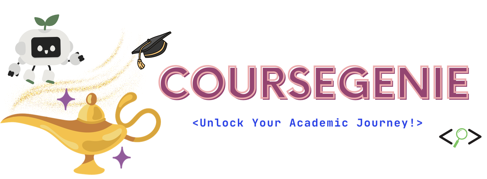
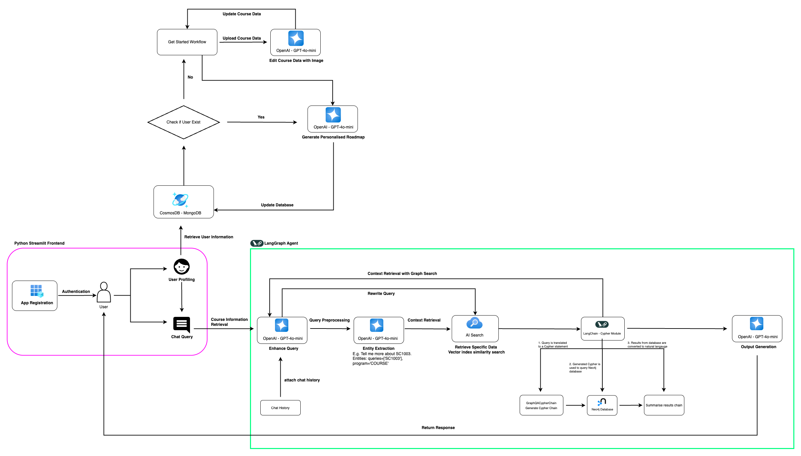
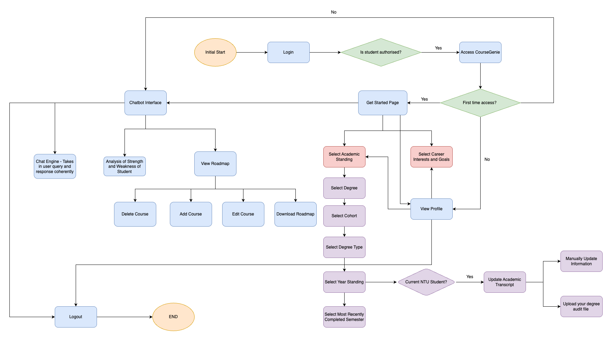

  </img>
</a>

**NTU CourseGenie** is an intelligent web-based chatbot specifically designed to bridge the gap between students' academic motivations and the education offerings at NTU's College of Computing & Data Science (CCDS). By leveraging on sophisticated Retrieval-Augmented Generation (RAG) techniques, CourseGenie provides precise, context-aware course recommendations that help students efficiently navigate the complex CCDS curriculum. The chatbot aims to streamlines course research by offering personalised guidance based on user input, ensuring students receive tailored academic pathways aligned with their interest and goals. 

### Key features

  </img>
</a>

 

- **Course Information Retrieval via Chatbot**
    - Ability to contextually understand follow-up questions
    - Provide personalised course recommendation based on user's career interest and academic performance
    - Feedback feature to allow users to provide feedback to every query-response pair for tracing and improvement of chatbot's response
- **Profile Creation for personalised recommendations**
    - Ability to create a personalised profile to state their academic background, interests and career aspirations
    - Provide the ability to upload degree audit seamlessly
    - Provide the ability to update user profile to retrieve up-to-date Course Recomendations
- **Visual Roadmap of Academic plan** 
    - Provide the ability to interact with the academic roadmap to further personalised their academic plan

 

  </img>
</a>

## Built With
### Frontend
 

### Backend
    

### Database
   

### Testing and Tracking
  

## Future Works

While NTU CourseGenie provides valuable assistance in course selection and planning process, there are several areas for further improvement to further enhance its functionality, usability and coverage. 

- Expanding Query Support: 

Currently, CourseGenie primarily provides course description and only support basic details, further enhancements such as the provision of course assessment styles, grading components and other key details that impact decision making can be provided. 

- Enabling Studend Feedback and Reviews

Serves as a one-stop Course Planning service which incorporates a student feedback system to enable users to share their experiences and insights about courses. Feedback can be further aggregated into structured ratings and reviews, making it easier for students to review their courses. 

- Enhancing the Course Roadmap Interface

Course planning roadmap can be redesigned with a more dynamic and interactive UI. Further updates wil include drag-and-drop functionality, visual timeline adjustments, and improved filtering options to streamling the planning process.

- Extending Course Coverage

Expanding the number of courses supported is one of the key priority. Currently, CourseGenie only covers courses offered by CCDS, hence, future iterations will broaden support to include more faculties and interdisciplinary programs. This will ensure a more comprehensive platform that caters to diverse academic pathways. 

